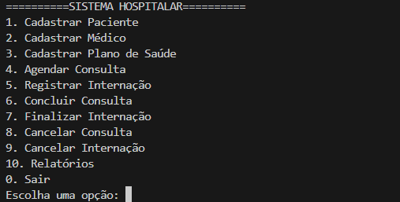
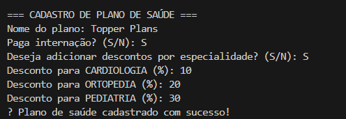
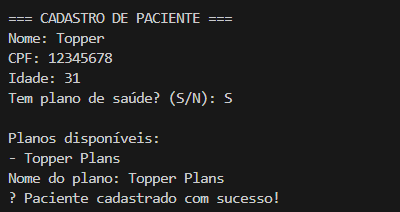
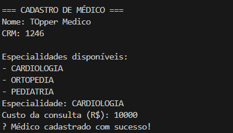
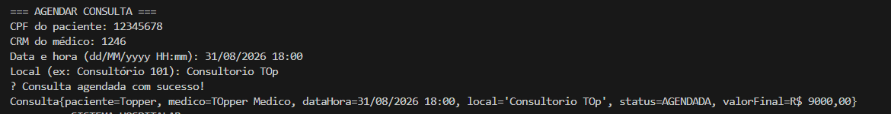
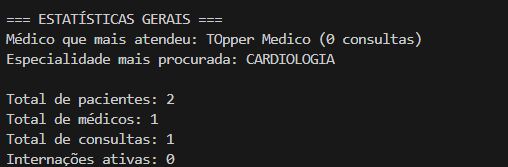

# 🏥 Trabalho Prático – Sistema de Gerenciamento Hospitalar  

### 🎯 Objetivo  
Implementar um *Sistema de Gerenciamento Hospitalar* em *Java, aplicando conceitos avançados de **Programação Orientada a Objetos (POO), com foco em **herança, polimorfismo, encapsulamento, persistência de dados* e *regras de negócio mais complexas*.  

---
## Descrição do Projeto

Desenvolvimento de um sistema de gerenciamento hospitalar utilizando os conceitos de orientação a objetos (herança, polimorfismo e encapsulamento) e persistência de dados em arquivos.

## Dados do Aluno

- **Nome completo:** Edson Gabriel Barbosa Brandão
- **Matrícula:** 242015826
- **Curso:** Engenharia de Software
- **Turma:** 02

---

## Instruções para Compilação e Execução

1. **Compilação:**  
   cd scr -> javac classes/*.java

2. **Execução:**  
   cd scr -> java classes.Interface

3. **Estrutura de Pastas:**  
```
   ep1_OO_2025-2_Edson_Gabriel/
   │
   ├──.vscode 
   ├──bin/
   ├──lib/ (criados pela extensao de projeto java)
   ├── src/
   │   ├── classes/
   │   │   ├── Paciente.java
   │   │   ├── PacienteEspecial.java
   │   │   ├── Medico.java
   │   │   ├── PlanoDeSaude.java
   │   │   ├── Especialidade.java
   │   │   ├── Consulta.java
   │   │   ├── Internacao.java
   │   │   ├── Hospital.java
   │   │   ├── GerenciadorArquivos.java
   │   │   └── Interface.java
   │   │
   │   └── dados/  (aparece so depois de encerrar o programa)
   │       ├── pacientes.csv
   │       ├── medicos.csv
   │       ├── planos.csv
   │       ├── consultas.csv
   │       └── internacoes.csv
   │
   ├── imgs/
   │   ├── Agendamento_OO.png
   │   ├── Cadastro_plano_OO.png
   │   ├── cadastro_paciente_OO.png
   │   ├── cadastro_medico_OO.png
   │   ├── Agendamento_OO.png
   │   └── Estatisticas_gerais_OO.png
   │
   └── README.md
```

3. **Versão do JAVA utilizada:**  
   java 21

---

## Vídeo de Demonstração

- [https://youtu.be/b--xcb-2Lz0]

---

## Prints da Execução

1. Menu Principal:  
<<<<<<< HEAD
   

2. Cadastro Plano de Saude:
   

3. Cadastro Paciente:
   

4. Cadastro de Médico:  
   

5. Agendamento:
   
=======
   

2. Cadastro Plano de Saude:
   

3. Cadastro Paciente:
   

4. Cadastro de Médico:  
   

5. Agendamento:
   
>>>>>>> 5672eed86f1f46ed27ba4381a2db3a0daad2cf69

6. Relatório Geral:  
   

---

## Observações (Extras ou Dificuldades)

- Dificuldades:
   - Achar por onde começar, quais classes criar
   - Achar um lugar para aplicar o conceito de herança -> Criei a classe PacienteEspecial
   - Impletar a parte de salvar dados
   - Achar uma maneira simples de implementar as especiliades, tava na duvida se faria algo mais dinamico com o usuario adicionando qualquer, ou um map com descontos prefixos etc. Decidi fazer algo bem simples com os enums.
   - Muitos.. e muitos problemas tecnicos.

---

## Contato

- edsongabrielbb@gmail.com

---

### 🖥️ Descrição do Sistema  

O sistema deve simular o funcionamento de um hospital com cadastro de *pacientes, médicos, especialidades, consultas e internações*.  

1. *Cadastro de Pacientes*  
   - Pacientes comuns e pacientes especiais (ex: com plano de saúde).  
   - Cada paciente deve ter: nome, CPF, idade, histórico de consultas e internações.  

2. *Cadastro de Médicos*  
   - Médicos podem ter especialidades (ex: cardiologia, pediatria, ortopedia).  
   - Cada médico deve ter: nome, CRM, especialidade, custo da consulta e agenda de horários.  

3. *Agendamento de Consultas*  
   - Um paciente pode agendar uma consulta com um médico disponível.  
   - Consultas devem registrar: paciente, médico, data/hora, local, status (agendada, concluída, cancelada).  
   - Pacientes especiais (plano de saúde) podem ter *vantagens*, como desconto.  
   - Duas consultas não podem estar agendadas com o mesmo médico na mesma hora, ou no mesmo local e hora

4. *Consultas e Diagnósticos*  
   - Ao concluir uma consulta, o médico pode registrar *diagnóstico* e/ou *prescrição de medicamentos*.  
   - Cada consulta deve ser registrada no *histórico do paciente*.  

5. *Internações*  
   - Pacientes podem ser internados.  
   - Registrar: paciente, médico responsável, data de entrada, data de saída (se já liberado), quarto e custo da internação.  
   - Deve existir controle de *ocupação dos quartos* (não permitir duas internações no mesmo quarto simultaneamente).  
   - Internações devem poder ser canceladas, quando isso ocorrer, o sistema deve ser atualizado automaticamente.

6. *Planos de saúde*    
   -  Planos de saude podem ser cadastrados.
   -  Cada plano pode oferecer *descontos* para *especializações* diferentes, com possibilidade de descontos variados.
   -  Um paciente que tenha o plano de saúde deve ter o desconto aplicado.
   -  Deve existir a possibilidade de um plano *especial* que torna internação de menos de uma semana de duração gratuita.
   -  Pacientes com 60+ anos de idade devem ter descontos diferentes.

7. *Relatórios*  
   - Pacientes cadastrados (com histórico de consultas e internações).  
   - Médicos cadastrados (com agenda e número de consultas realizadas).  
   - Consultas futuras e passadas (com filtros por paciente, médico ou especialidade).  
   - Pacientes internados no momento (com tempo de internação).  
   - Estatísticas gerais (ex: médico que mais atendeu, especialidade mais procurada).  
   - Quantidade de pessoas em um determinado plano de saúde e quanto aquele plano *economizou* das pessoas que o usam.  


---

### ⚙️ Requisitos Técnicos  
- O sistema deve ser implementado em *Java*.  
- Interface via *terminal (linha de comando)*.  
- Os dados devem ser persistidos em *arquivos* (.txt ou .csv).  
- Deve existir *menu interativo*, permitindo navegar entre as opções principais.  

---

### 📊 Critérios de Avaliação  

1. *Modos da Aplicação (1,5)* → Cadastro de pacientes, médicos, planos de saúde, consultas e internações.  
2. *Armazenamento em arquivo (1,0)* → Dados persistidos corretamente, leitura e escrita funcional.  
3. *Herança (1,0)* → Ex.: Paciente e PacienteEspecial, Consulta e ConsultaEspecial, Médico e subclasses por especialidade.  
4. *Polimorfismo (1,0)* → Ex.: regras diferentes para agendamento, preços de consultas.
5. *Encapsulamento (1,0)* → Atributos privados, getters e setters adequados.  
6. *Modelagem (1,0)* → Estrutura de classes clara, bem planejada e com relacionamentos consistentes.  
7. *Execução (0,5)* → Sistema compila, roda sem erros e possui menus funcionais.  
8. *Qualidade do Código (1,0)* → Código limpo, organizado, nomes adequados e boas práticas.  
9. *Repositório (1,0)* → Uso adequado de versionamento, commits frequentes com mensagens claras.  
10. *README (1,0)* → Vídeo curto (máx. 5 min) demonstrando as funcionalidades + prints de execução + explicação da modelagem.  

🔹 *Total = 10 pontos*  
🔹 *Pontuação extra (até 1,5)* → Melhorias relevantes, como:  
- Sistema de triagem automática com fila de prioridade.  
- Estatísticas avançadas (tempo médio de internação, taxa de ocupação por especialidade).  
- Exportação de relatórios em formato .csv ou .pdf.  
- Implementação de testes unitários para classes principais.  
- Menu visual.
